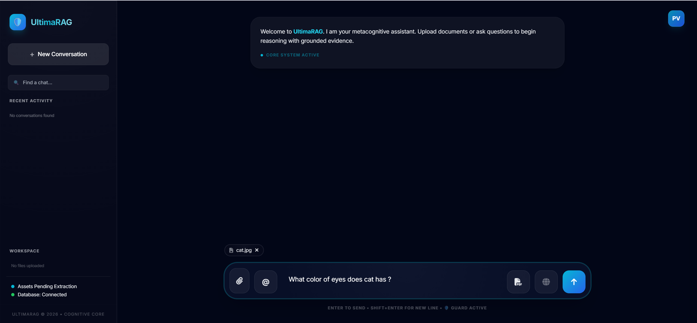
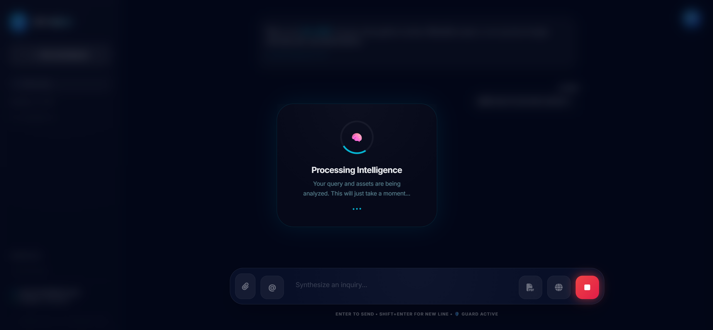
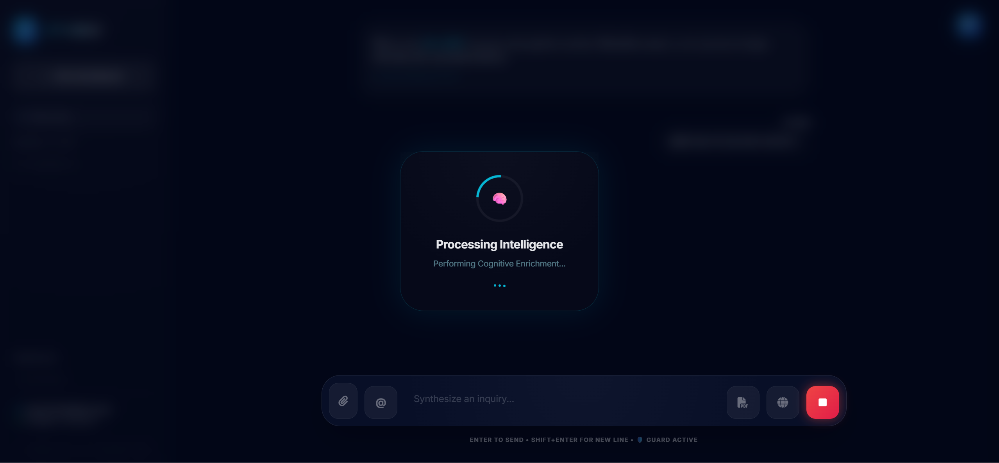
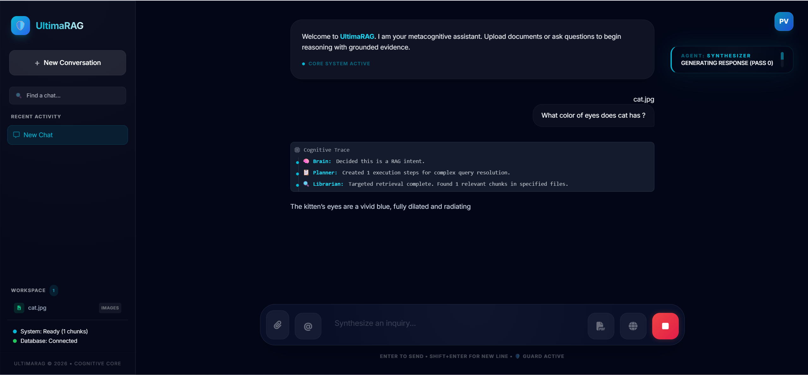
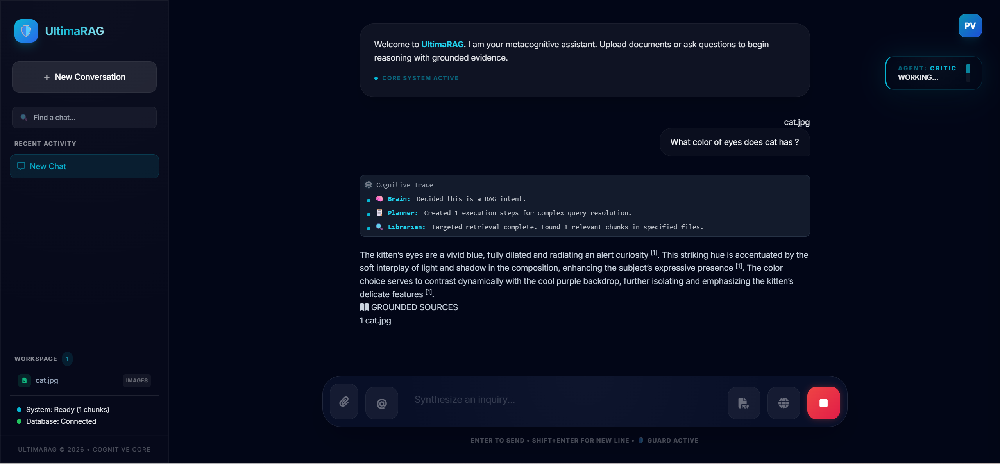
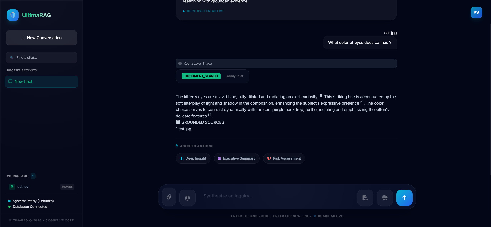
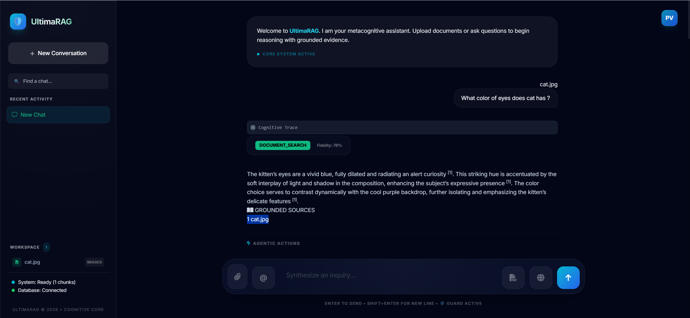
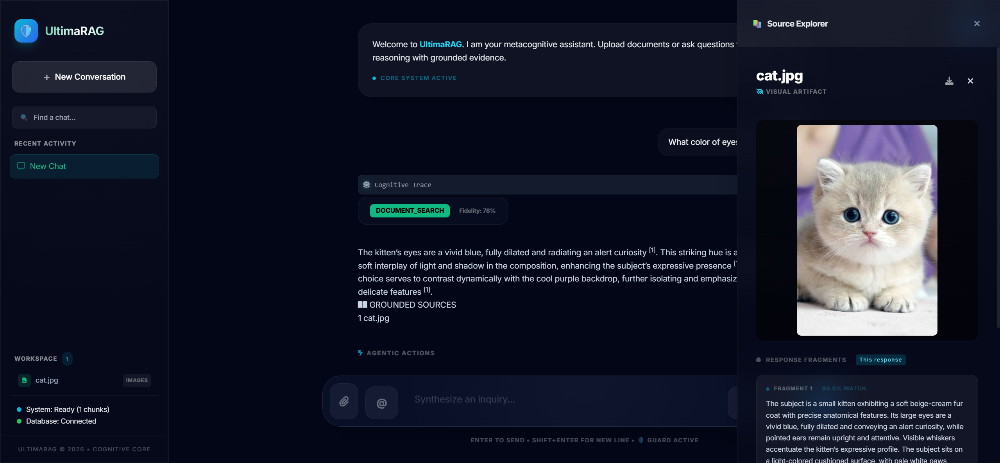
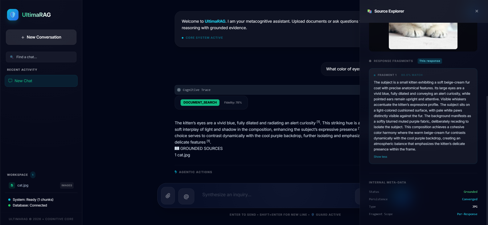
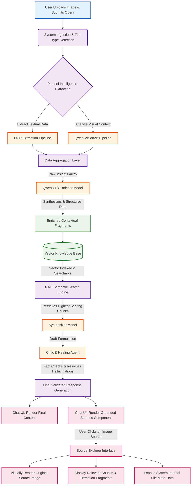

# SpandaOS Image Processing Workflow

This document provides a detailed, professional overview of the image processing capabilities within SpandaOS. It outlines the step-by-step lifecycle of an image, from the initial user upload through insight extraction, response generation, and comprehensive source exploration.

## Step 1: Image Selection and Query Submission
To initiate the image processing workflow, **we must select and upload an image and ask a query alongside the media upload**. This dual-input approach is vital, as it provides the system with both the visual context (the media) and the specific objective of your inquiry (the query), allowing the AI to focus on the exact details you need.

## Step 2: Dual-Model Extraction (OCR & Vision)
Once uploaded, **the system will detect the image file and start extracting meaningful insights from the image**. We employ a robust, dual-model pipeline for maximum accuracy:
- **Simple OCR Model:** Scans the media to extract all raw textual data embedded within the image.
- **Qwen-Vision2B Model:** Analyzes visual elements, structural layout, and graphical context to comprehensively describe the image's non-textual elements.

## Step 3: Data Enrichment via Qwen3:4B
**Once the proper processing by the OCR and Qwen-Vision models finishes, these extracted insights get delivered to the 'Qwen3:4B' model for enrichment.** This larger, multi-modal reasoning engine merges the raw optical text with the semantic visual descriptions. It structures, refines, and synthesizes this data into highly cohesive context, properly formatted for downstream retrieval.

## Step 4: Knowledge Base Storage & RAG Initiation
**Once enrichment gets done and the image-related textual data gets stored in the knowledge base, the application starts processing the user query with the RAG (Retrieval-Augmented Generation) flow.** By securely indexing the enriched textual descriptions into our vector database, the originally unstructured image essentially transforms into a highly searchable repository of knowledge.

## Step 5: Context Retrieval and Synthesis
**Based on the user query, the RAG flow scrapes the related context from the knowledge base and delivers it to the Synthesizer model to generate a proper response.** The RAG engine uses semantic similarity matching to locate the exact informational fragments from the image required to accurately answer the prompt, rather than relying on generalized knowledge.

## Step 6: Verification by Critic & Healing Agent
**Once the synthesizer finishes producing the response, the Critic and Healing agent checks and verifies whether the response is proper or not, and fills any missing gaps.** This metacognitive verification layer strictly compares the generated response against the retrieved source chunks. It prevents AI hallucinations and ensures the final answer possesses unquestionable factual integrity.

## Step 7: Final Response & Grounded Sources
**Once a detailed response gets generated, we will get the image name listed below "Grounded Sources." If we click on the file name, the image will get loaded into the source explorer.** This feature champions conversational traceability, providing users the distinct ability to trace every piece of information generated by the AI back to its precise origin.

## Step 8: Source Explorer & Evidence Tracking
**In the source explorer page, the image will get rendered, and all the extracted insights from the image will be written in the fragments (chunks) which were responsible for the generation of the proper response.** This transparent, side-by-side view empowers users to manually cross-reference the AI's understanding against the actual visual data.

## Step 9: Internal Meta-Data Review
**At the end of the file, internal meta-data related to the file will be written.** This provides administrators and advanced users with complete technical transparency regarding the file's processing life-cycle, including vector indexing identifiers, ingestion timestamps, and other core system parameters.

---

## Detailed Image Processing Architecture Flow

The following Mermaid.js diagram provides an extremely detailed, end-to-end visualization of the SpandaOS image processing architecture.

